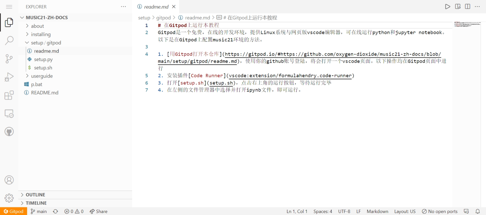
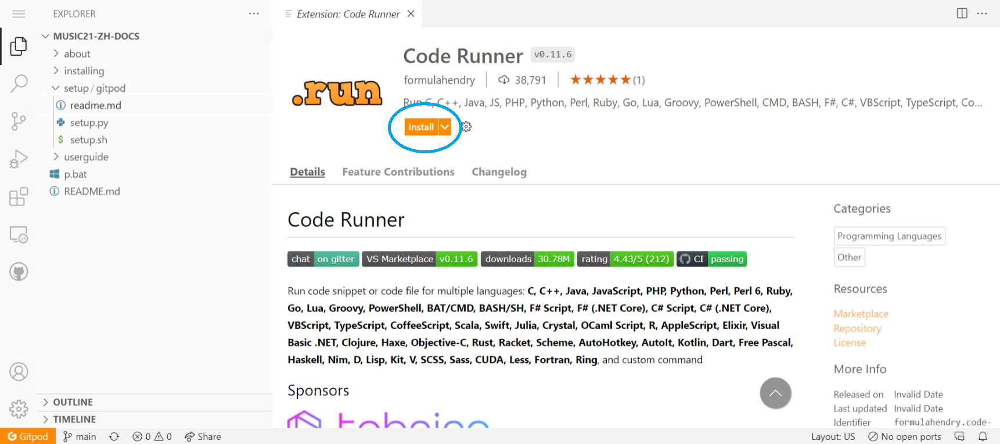
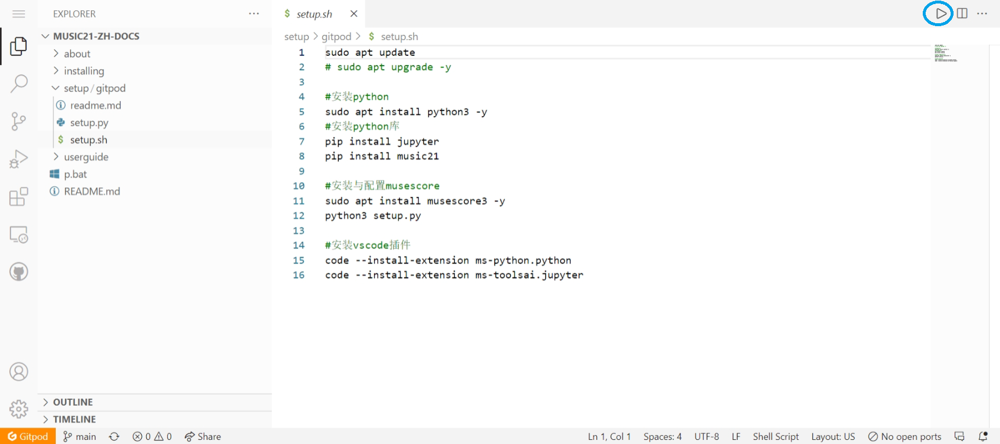
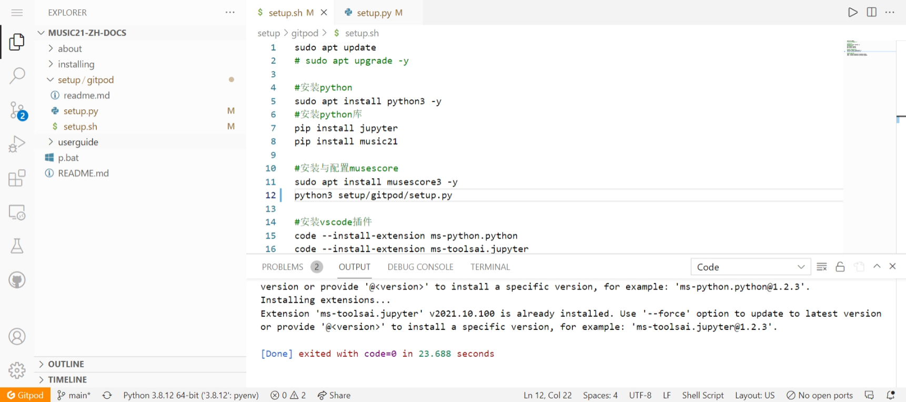

# 在Gitpod上运行本教程
Gitpod是一个免费，在线的开发环境，提供Linux系统与网页版vscode编辑器，可在线运行python和jupyter notebook。以下是在Gitpod上配置music21环境的方法。

1. [用Gitpod打开本仓库](https://gitpod.io/#https://github.com/oxygen-dioxide/music21-zh-docs/blob/main/setup/gitpod/readme.md)，使用你的github账号登陆，将会打开一个vscode页面。
   
   打开setup/gitpod/readme.md
   
   

   以下操作均在Gitpod页面中进行
2. 安装插件[Code Runner](vscode:extension/formulahendry.code-runner)
   
   

3. 打开[setup.sh](setup.sh)，点击右上角的运行按钮
   
   

   命令行中将会输出大量内容，请耐心等待运行完毕（命令行中输出Done）
   
   

4. 在左侧的文件管理器中选择并打开ipynb文件，即可运行。